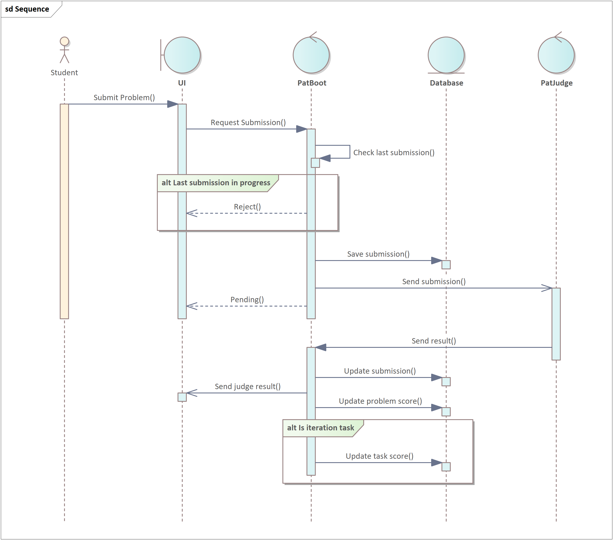

# Make PatBoot Better

> PatBoot 开发说明

---

## Overview

### 技术栈

PatBoot 使用 Java 17 开发，采用 Maven 进行项目管理，具体涉及如下的技术。

- Spring Boot 3
- MyBatis 3 + MySQL
- RabbitMQ
- AspectJ
- Logback

### 项目结构

整个项目位于 `cn.edu.buaa.patpat.boot` 包中，其中包括：

- `aspect`：全局的 AOP 类。
- `common`：公共的类型以及工具类（只包含 static 方法，非 `@Component`。）
- `config`：全局的项目配置。
- `exceptions`：全局的异常。
- `extensions`：扩展类，其实也属于工具类，但是是 `@Component`。
- `modules`：具体的业务逻辑模块。

`modules` 中为项目具体的业务逻辑模块，每个模块中的包划分如下。

- `api`：暴露给其他模块的接口。
- `aspect`：由该模块功能提供的 AOP 类。
- `config`：该模块涉及的配置，以及需要注入的 Bean。
- `controllers`：Controllers，仅作路由转发，不包含逻辑。
- `dto`：Data Transfer Object，请求或者返回类型。
- `models`：数据库类型。
- `services`：Services，承担业务逻辑。

在项目的 resources 中，包含项目的配置文件，有 dev、stag 和 prod 三个 Profile。也有数据库建表的 SQL，日志的配置文件，以及 i18n 用到的中英双语消息文本。static 里是为了给 Swagger 添加深色背景的 CSS。

### 指导思想

项目采用经典的 MVC 模式，路由由 Controller 转发至 Service，在涉及数据库操作时，Service 再调用 Mapper。

对于业务逻辑，采用功能驱动的模块划分，每个单独的功能为 `modules` 包下的一个具体模块，如 `modules.course`。这样的模块划分可以模拟微服务，每一个模块内部包含其负责的所有功能，并通过 `api` 向外暴露接口，从而实现模块间的联动。

对于联合查询的场景，使用 View 对象，尽可能在一个 SQL 语句中完成。

---

## 编码规范

### 命名规范

采用 Java 主流的命名方式，具体的，方法和变量使用 camelCase 命名，类和接口使用 PascalCase。

SQL 表名、字段名采用 snake_case，能够和 Java 的 camelCase 相互转换。

**前/后缀**

- 接口添加 `I` 前缀，基类添加 `Base` 前缀。
- Controller 以 `Controller` 结尾，管理员接口的 Controller 以 `AdminController` 结尾。
- Service 以 `Service` 结尾，如果是仅由管理员接口调用的 Service，则以 `AdminService` 结尾。
- Mapper 以 `Mapper` 结尾，如果是负责复杂查询的 Mapper，以 `FilterMapper` 结尾。
- DTO 以 `Dto` 结尾，如果是请求（请求的 Body），则以 `Request` 结尾。
- `api` 包下的 API 以 `Api` 结尾。
- `model` 中，`entities` 存放表对象，与表名相同，但是使用 PascalCase。`views` 存放 View 对象，以 `View` 结尾。

### RESTful 接口

**Method**

创建操作使用 POST，更新操作使用 PUT，删除操作使用 DELETE，查询操作使用 GET。

**URL**

> 这部分命名比较主观，参考 Swagger 页面中现有的路由编写，不突兀即可。

所有接口以 `/api` 为前缀，后跟模块/功能名称，如果为管理员特有接口，在 `api` 后添加 `admin`。PUT、DELETE、GET 操作中涉及的 ID 均作为路由参数，而不包含在请求体中。例如，对于课程管理的接口如下。

```
POST   /api/admin/course/create
PUT    /api/admin/course/update/{id}
DELETE /api/admin/course/{id}
GET    /api/course/all
GET    /api/course/{id}
```

当然，在 PatBoot 中，课程操作的 ID 可以由 Cookies 获取，从而进一步减少路由参数。

不要在 URL 中使用 `_` 等，尽量每个词之间都通过 `/` 分开。

对于请求参数，POST、PUT 使用 `application/json`，如果带有文件，使用 `form-data`。GET 和 DELET 使用 Query Parameter。

### 代码组织

#### 全局代码

如果代码与模块无关，则属于“全局代码”，放在 `modules` 之外的包中，具体参考现有的包。

为了稍微简洁一些，AOP 中的 Annotation 和 Aspect 均放在 `aspect` 包中。

#### 模块代码

一个模块能够提供一套完整的服务，其包含全局代码中的所有类别，但都是模块独有的。具体地，在一个模块中：

- 向外部暴露的接口放在 `api` 中。
- 提供的 AOP 类放在 `aspect` 中。
- 配置或注入的 Bean 放在 `config` 中。
- Controllers 放在 `controller` 中，并且学生和助教的 Controller 分开，Controller 可以依赖于一个或多个 Service，**不允许**直接调用 Mapper，只能委托给 Service。
- 请求对象、返回对象放在 `dto` 中。
- 数据库对象放在 `models` 中，其中包含 `entities`、`views` 和 `mappers`。`entities` 与数据库中的对象一致，用于增删改，也可以用于单表的全量查询。当涉及联合查询，或查询单表部分字段作为返回值时，在 `views` 中新建 View 对象。查询类 Mappers 写在 `mappers` 中，每张表对应一个 Mapper。如果 Mapper 中包含大量查询，可以考虑将查询部分单独写为 FilterMapper，专门用于查询。如果涉及复杂查询需要动态 SQL，则在 `mapper` 中新建 default 权限的 `MapperProvider`（无 `public`）。
- Service 作为具体的业务逻辑，放在 `services` 中。

该项目中，Service 不设置对应的接口，直接注入实现类。对于有多个实现的 Service，才使用接口或抽象基类注入，如 `JudgeService`，此时实现类放在 `services.impl` 中。

一般来说一个 Controller 对应一个 Service，如果 Service 太大，则按功能拆分成多个 Service。如果某一业务逻辑较为复杂，如导入导出，则在 `services.impl` 中创建代理类（如 `StudentImporter`、`DownloadAgent`）实现对应功能。

---

## 文件操作

### 存储桶

`bucket` 模块为应用提供了一个存储桶功能，可以方便地通过文件 ID 得到其在服务器的存储位置，以及可能的网络 URL 位置。Bucket 有两个存储位置，对应私有和公有文件。共有文件能够直接通过 URL 访问，私有文件则只能通过请求获取。这里，私有文件对应 `bucket` 目录，公有文件对应 `wwwroot` 目录。

每一个文件都有一个文件 ID（代码中为 record），由 Tag 和文件名构成，例如，学生 21370000 的 Tag 就是 `21370000`，头像文件经过随机化后为 `oK3f....F4.png`，那么通过 `BucketApi::toRecord` 就可以得到其 ID 为：`21370000/oK3f....F4.png`。进而，使用 `BucketApi::recordToPublicPath` 就可以得到它作为公有文件的存储路径，使用 `BucketApi::recordToUrl` 就可以得到它对应的 URL。

如果文件名需要随机化，可以直接使用 `BucketApi::toRandomRecord` 在保留文件扩展名的情况下得到文件 ID。如果需要临时文件或目录，也有对应的函数。

更进一步，如果存在子目录，可以使用变体 `BucketApi::toRecord(String tag, String... args)`，确保文件名在最后一个参数即可。

### 文件操作工具

PatBoot 提供了两个文件工具类，`Medias` 和 `Zips`。`Medias` 提供了常用的文件操作封装，`Zips` 提供了文件压缩/解压缩操作。

---

## 消息

### WebSocket 消息

WebSocket 相关功能在 `stream` 包中，只需要使用 `StreamApi` 即可。当用户需要 WebSocket 时，首先请求获取其 WebSocket URL，然后就可以连接了。每个用户有一个 Tag，即学号，可对应多个 WebSocket 连接。当发送消息时，会向同一用户的所有 WebSocket 连接发送。

WebSocket 消息包含 Type 和 Payload 两部分，具体消息类型见 `Globals` 中的 `WS_` 字段。Payload 为任意对象。

### 系统消息

当用户订阅的讨论区有新消息时，会向用户发送系统消息。这部分功能在 `message` 包中，只需要使用 `MessageApi` 即可。如果想同步实时通知用户，需要借助 `StreamApi`。发送消息时，需要额外提供课程 ID 和用户 ID。

消息由三部分组成：Type，Payload 和 Argument。消息类型见 `Globals` 中的 `MSG_` 字段。Payload 为任意对象，并非消息本身，需要前端将 JSON 对象渲染为消息文本。*Argument 用于具有特殊动作的消息，如额外的按钮与状态，可以为 `null`，目前并没有用到。*

---

## 最佳实践

> 这一节介绍开发中常用到的一些方式与技巧，在现有的代码中都有体现，可以参考。

### 异常处理

在全局的 `exception` 中定义了对应不同 HTTP Status 的异常，在任何地方只需要抛出对应异常即可返回请求失败。

### 注解

对于数据类，如 View，Dto 等，使用 `@Data` 自动生成 getter 和 setter。

如果需要包含所有成员变量的构造函数，使用 `@AllArgsContructor` 自动生成，同时，可以使用 `@AllArgsConstructor(access = AccessLevel.PRIVATE)` 声明私有的构造函数。

依赖注入使用构造函数注入，不显示写 `@Autowired` 或 `@Resource`，注入的变量使用 `private final`，同时结合 `@RequiredArgsConstructor` 生成构造函数，减少冗余代码。（当作为 Bean 的基类时，使用 `@Autowired` 注入。）

对于 Controller，使用 `@Tag(name = "...", description = "...")` 更改其在 Swagger 中的默认标签。对于 Controller 中的方法，使用 `@Operation(summary = "...", description = "...")` 简要说明其功能。

如果需要日志，使用 `@Slf4j` 注入 `logger`，**禁止**使用 `System.out`。

### AOP

利用面向切面编程简化参数处理，目前 PatBoot 提供了很多相关注解。

#### 参数校验

对于请求对象（XxxRequest），在其中使用 Jarkatar 相关注解添加约束，如 `@NotNull`，`@Min`，`@Size` 等。为了实现空值检测，其中的类型均需使用封装类型，即使用 `Integer` 代替 `int`。同时，在请求中使用 `@Valid` 注解启用校验。如果请求对象包含更复杂的校验，则需要实现 `IRequireValidation` 接口，实现 `validate` 方法，在参数错误时抛出 `BadRequestException` 等异常，同时在方法上添加 `@ValidateParameters` 从而在执行前调用该方法进行校验。

如果请求包含文件（`MultipartFile`），可以使用 `@ValidateMultipartFile` 进行校验，其中包含了几种对文件的约束。

如果是分页请求，可以使用 `@ValidatePagination` 进行校验，请求中用 `@Page` 修饰页码（`int`），用 `@PageSize` 修饰页大小（`int`）。

#### 参数注入

默认除了登录注册的所有接口都需要用户登录，由 `auth` 模块的 Interceptor 完成。如果想不访问数据库就得到用户信息，需要获取用户请求中的 Token，即 `AuthPayload`。此时，可以通过参数注入完成。

**权限验证**

在路由方法上添加 `@ValidatePermission`，未登录会抛异常，否则就会将用户的 `AuthPayload` 注入到当前的方法中。如果方法中没有 `AuthPayload` 类型的参数，则仅作校验。

对于管理员接口，可以通过添加参数实现权限验证，例如 `@ValidatePermission(AuthLevel.TA)` 只允许 T.A. 和老师访问该接口。

**课程注入**

大量接口需要获取当前课程，因此可以在方法上添加 `@ValidateCourse` 注入当前课程，未选择课程会抛异常。成功的话，有两种注入方式。如果仅关心当前课程 ID，可以使用 `@CourseId`，将课程 ID 注入方法的一个 `Integer` （不能是 `int`）参数。如果还关心课程中的学生 ID、教师 ID，则可以注入 `CoursePayload` 类型的参数。

**团队注入**

要获得当前的团队配置（`GroupConfig`），可以为方法添加 `@WithGroupConfig`，会为方法注入当前课程的 `GroupConfig`。这个注解依赖于 `@ValidateCourse`，因此同时方法中也需要包含 `@CourseId` 注解的课程 ID，尽管你没有用到。其中，可以设置是否只能在团队功能启用时调用。

如果要获得当前学生所在的团队，可以为方法添加 `@ValidateGroup`，其中可以设置对组的一些约束，如要求在组里，要求不在组里，以及要求是组长。该方法会注入 `GroupMember` 和  `Group` 参数。其依赖于 `@ValidateCourse` 和 `@ValidatePermission`，因此请求方法中也需要包含 `@CourseId` 注解的课程 ID 和 `AuthPayload`，尽管你没有用到。需要注意的是，`GroupMember` 和 `Group` 都可以获取所在组的 ID，如果只关心小组 ID，注入 `Group Member` 可以避免对 Group的查询。此外，如果没有设置 `requireInGroup`，那么注入的 `GroupMember` 或 `Group` 可能为 `null`。

---

## 附录

这里给出一些复杂用例的 UML 图。

### 提交 Lab 报告

提交 Lab 报告时，为了之后打包方便，将助教和学生的提交分开存放。提交后，为学生创建此次 Lab 的成绩，但默认没有分数，需要之后打分。该用例的活动图如下。


### 提交评测

提交评测涉及如下几个动作：

- 用户提交待评测文件
- PatBoot 向 PatJudge 提交评测请求
- PatJudge 向 PatBoot 返回评测结果
- PatBoot 根据评测结果更新提交信息，以及相关分数，注意当题目为迭代时，还应更新迭代分数。

该用例的顺序图如下。



对应的活动图如下。


